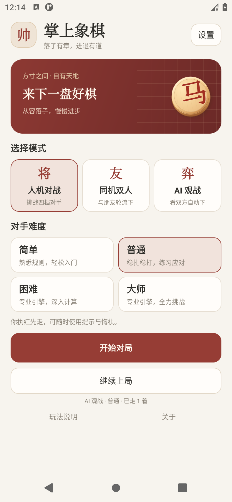
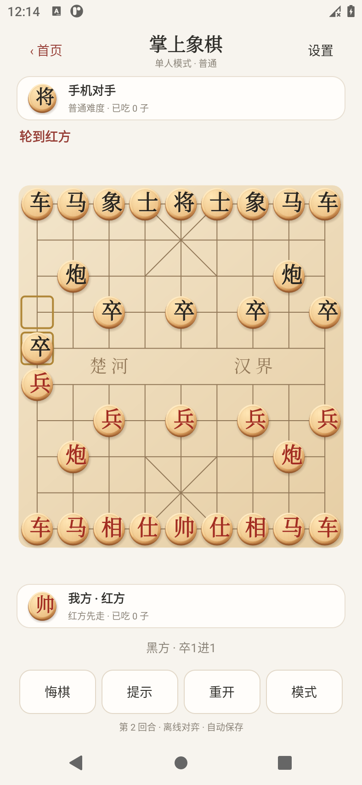

# 掌上象棋 2.1

离线安卓象棋游戏：先在主界面选择模式与难度，再开始对局。支持人机对战、同机双人、AI 对战 AI 观战、提示、悔棋、重开、认输和自动存档。

## 安装

[下载掌上象棋.apk](output/掌上象棋.apk)，约 50 MB。支持 Android 8.0 及以上的 64 位 ARM 手机；安装包也包含 x86_64 测试版本。

把 APK 发到手机后点击安装。2.1 与之前版本使用相同签名，可以覆盖安装并保留旧棋局。无需登录或联网。

## 主界面与对局

- 人机对战：你执红，手机执黑。
- 同机双人：两个人轮流操作同一部手机。
- AI 观战：双方自动走棋，支持暂停、下一步和速度调整。
- 继续上局：保留原棋局与难度，首页的新局设置不会覆盖它。
- 设置：落子震动；玩法说明与关于。

四档难度为简单、普通、困难、大师。简单与普通使用轻量本地对手；困难与大师使用 Pikafish 专业引擎。大师是本游戏的最高档，不代表正式赛事棋力评级。

棋盘显示轮走方、双方信息、已吃棋子数、回合和上一着。支持合法落点、将军、将死、困毙、提示与悔棋。返回首页或退出游戏都会保存；观战会自动暂停。

2.1 按新版效果图更新木质棋子：圆润倒角、微凸表面、柔和高光与阴影，使用清晰的红黑字样；双方头像与首页装饰棋子采用相同样式。棋子实时绘制，适配不同手机尺寸。

## 构建与验证

源码在 `app/src/main/java/com/yijin/xiangqi/light`；新原生桥接在 `app/src/main/cpp`，Pikafish 对应源码在 `engine/src/main/cpp/pikafish`。

运行 `tools/build-phone-apk.ps1`，会编译 arm64-v8a/x86_64 引擎并生成签名 APK。需要 JDK 17、Android SDK 36、build-tools 36.0.0、NDK 28.2.13676358、CMake 3.22.1。

检查脚本：`tools/ChessChecks.java`、`tools/check-home-ui.ps1`、`tools/check-phone-ui.ps1`、`tools/check-watch-ui.ps1`。安卓交互脚本仅用于可 root 的临时测试模拟器，会清除测试应用存档。

[使用与构建说明](05-简版手机游戏说明.md) · [当前工程状态](PROJECT_STATUS.md)

## 第三方与历史资料

Pikafish 采用 GPL-3.0 许可，对应源码和 Copying.txt 随本项目提供。NNUE 文件遵循上游非商业使用许可；许可证也随 APK 提供，详情见 `app/src/main/assets`。

01～04 号文档和旧 Kotlin/JNI 验证代码保留为历史参考；旧桥接不进入当前安装包。当前版本以本文和 05 号说明为准。

更新日期：2026-10-05。
