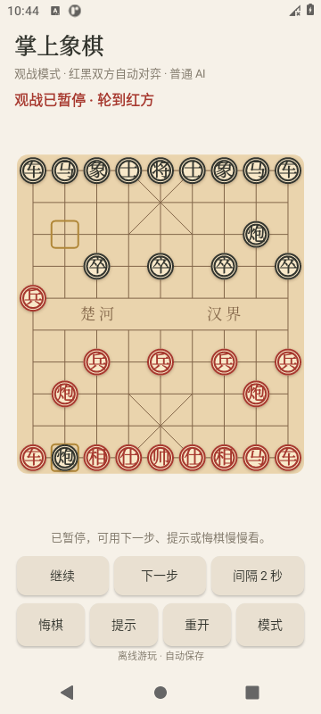

# 掌上象棋：自用安卓手机游戏

已按最新要求做成简单的离线手机版，支持单人（手机自动走黑棋）、同机双人、AI 对战 AI 观战、两档难度、悔棋、提示、重开和自动存档。

1.1 版新增观战：点“模式 → 观战：AI 对战 AI”，红黑双方会自动下棋。可以暂停、每次看一着、调整走棋间隔；暂停时可看提示或撤回一着。退出后保存并暂停。内置 AI 适合休闲练习，尚非大师棋力。

## 安装

[掌上象棋.apk](output/掌上象棋.apk)，约 33 KB，支持 Android 6.0 及以上。

把 APK 发到安卓手机，点击安装，打开“掌上象棋”即可。无需登录或联网，不需要另配电脑。

[使用与构建说明](05-简版手机游戏说明.md) · [当前工程状态](PROJECT_STATUS.md)

## 源码与构建

游戏代码在 `app/src/main/java/com/yijin/xiangqi/light`。使用安卓原生界面和 Java 轻量本地走棋，不依赖专业引擎或其网络文件。

运行 `tools/build-phone-apk.ps1` 生成签名安装包；具体 SDK/JDK 参数见使用说明。

规则检查：`tools/ChessChecks.java`。安卓交互检查：`tools/check-phone-ui.ps1`，该脚本只适用于临时测试模拟器。
观战交互检查：`tools/check-watch-ui.ps1`，同样只用于临时测试模拟器。

## 之前的规划资料

01～04 号文档和原生引擎实验代码保留为参考。最新产品范围以本简版游戏和 05 号说明为准；之前的大型训练应用规划不再是本次交付要求。

更新日期：2026-10-05。
